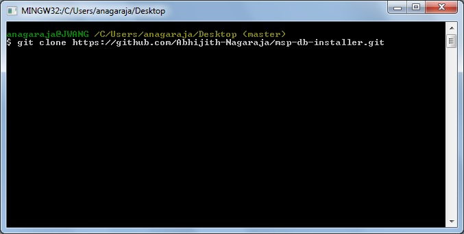
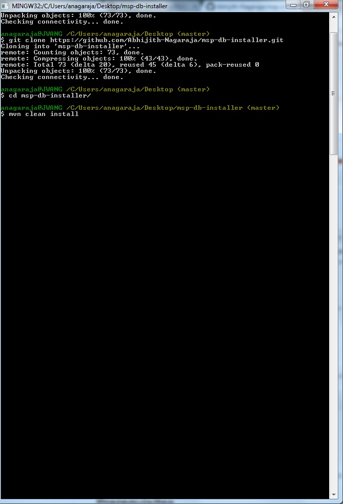
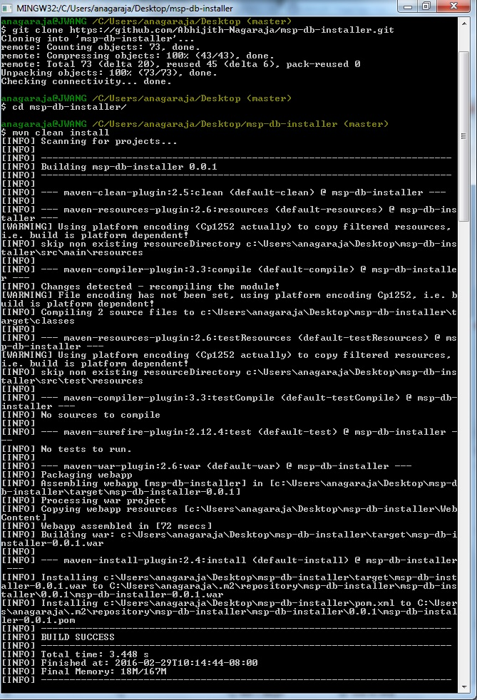
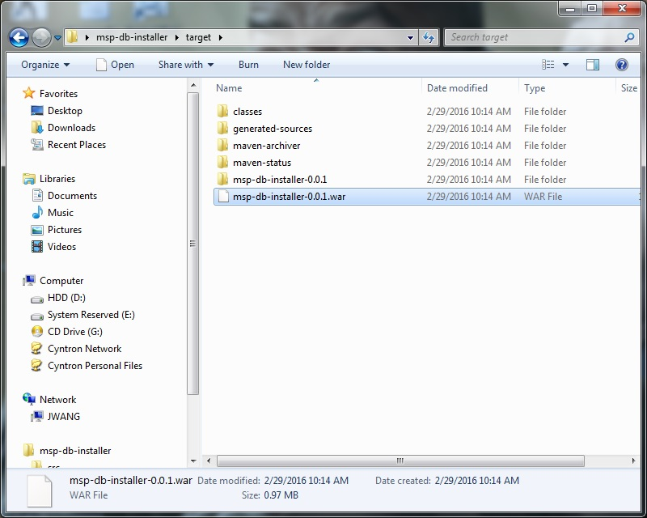
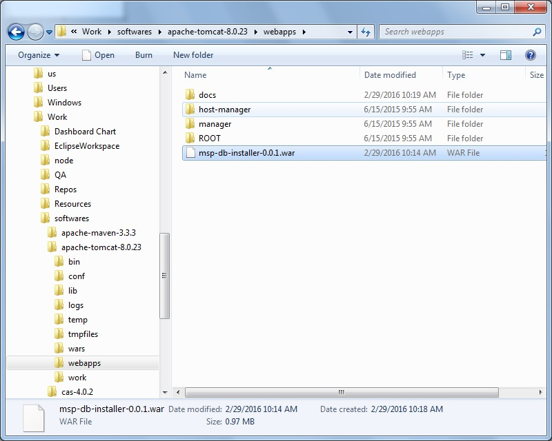
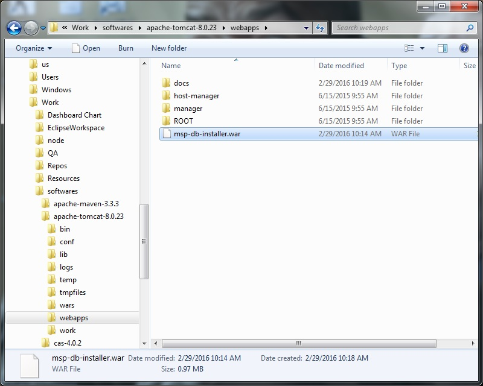
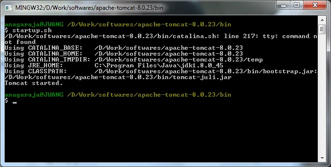
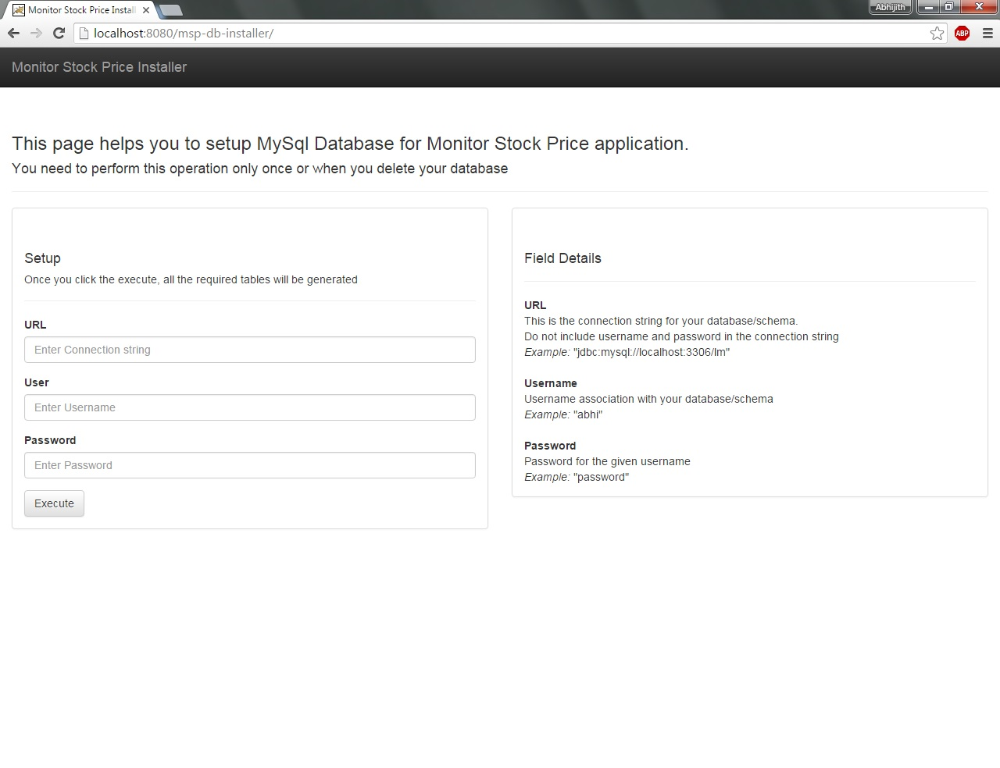
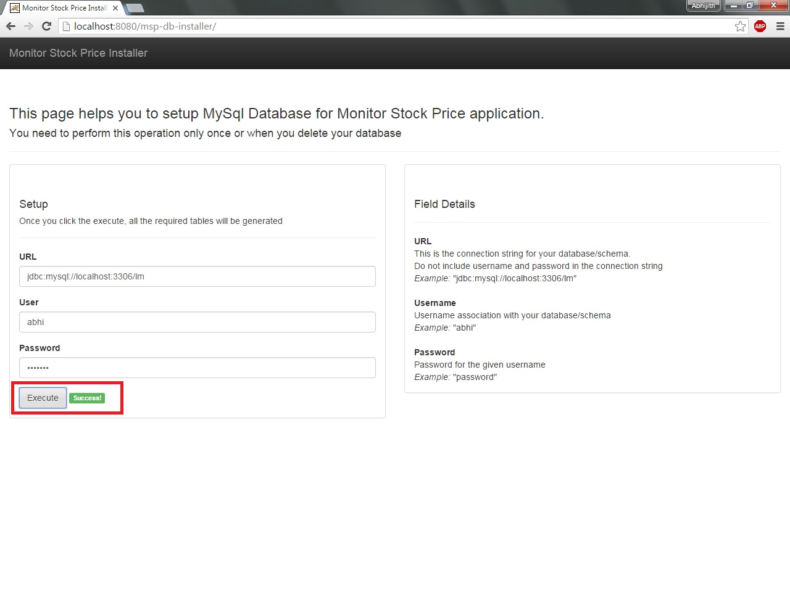

# msp-db-installer
  A database installer for https://github.com/Abhijith-Nagaraja/monitor-stock-price/

###Prerequisites
1. Java version 1.8
2. Maven (Easy step by step guide: http://www.tutorialspoint.com/maven/maven_environment_setup.htm)
3. Tomcat or any other server capabale of host java web project
4. Git
5. MySql Server

###Steps
1. Clone the project

      git clone https://github.com/Abhijith-Nagaraja/msp-db-installer.git
   
2. Go inside the clone directory and execute maven install
 
      mvn clean install
      <table>
        <tbody>
          <tr>
            <td></td>
            <td></td>
          </tr>
        </tbody>
      </table> 
3. Copy the war folder from projects target directory into your Tomcat server webapp directory and renmae if required
      <table>
        <tbody>
          <tr>
            <td></td>
            <td></td>
            <td></td>
          </tr>
        </tbody>
      </table> 
4. Start the Tomcat server 
        
5. Open the browser, go to "[your server address with port]://[war-name]/"
       
6. Enter all the input fields and click on execute
       
